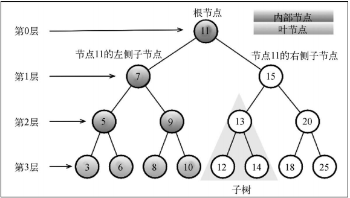
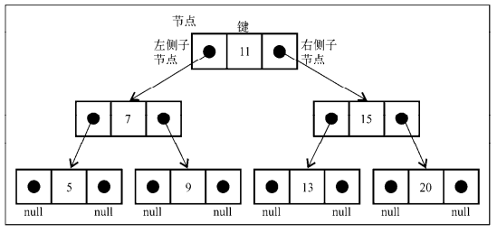

树是一种分层数据的抽象模型。

## 树的相关术语

一个树结构包含一系列存在父子关系的节点。每个节点都有一个父节点（除了顶部的第一个节点）以及零个或多个的子节点。

位于树顶部的节点叫作根节点。它没有父节点，树中的每个元素都叫作节点，节点分为内部节点和外部节点。至少有一个子节点的节点称为内部节点。没有子元素的节点称为外部节点或叶节点

一个节点可以有祖先和后代。（除根节点）一个节点的祖先包括父节点、祖父节点、增祖父节点等。一个节点的后代包括子节点、孙节点、曾孙节点等。

有关树的另一个术语是子树。 子树由节点和它的后代构成。

节点一个属性是深度，节点的深度缺觉于它的祖先节点的数量。

树的高度取决于所有节点深度的最大值。一颗树也可以被分解成层级。根节点在第0层，它的子节点在第1层，以此类推。



## 二叉树和二叉搜索树

二叉树中的节点最多只能有两个子节点：一个是左侧子节点，另一个是右侧子节点。这些定义有助于我们写出更高效地向/从树中插入、查找和删除节点的算法。

二叉搜索树 BST 是二叉树的一种，但是它只允许你在左侧节点存储（比父节点）小的值，在右侧节点存储（比父节点）大（或者等于）的值。

二叉搜索树 数据结构的组织方式：



和链表一样，将通过指针来表示节点间的关系。在双向链表中，每个节点包括两个指针，一个指向下一个节点，另一个指向上一个节点。因此，将声明一个Node类来表示树中的每一个节点。值得注意的是，不同于在之前章节将节点本身称作节点或项，我们将称其为键。键是树相关术语中对节点的称呼。

## 树的遍历

遍历一颗树是指访问树的每个节点并对它们进行某种操作的过程。
访问树的所有节点有三种方式：中序、先序和后序。

### 中序遍历

中序遍历是一种以 上行 顺序访问BST所有节点的遍历方式，也就是以从最小到最大的顺序访问所有节点。中序遍历的一种应用就是对树进行排序操作。下面是实现：

```js
this.inOrderTraverse = function(callback) {
  inOrderTraverseNode(root, callback)
}
```

inOrderTraverse 方法接受一个回调函数作为参数。回调函数用来定义我们对遍历到的每个节点进行的操作（这也叫作访问者模式）。由于我们在 BST 中最常实现的算法是递归，这里使用了一个私有辅助函数，来接收一个节点和对应的回调函数作为参数

```js
var inOrderTraverseNode = function(node, callback) {
  // 2 先检查以参数形式传入的节点是否为null
  if (node !== null) {
    // 3 递归调用相同函数访问左侧子节点
    inOrderTraverseNode(node.left, callback)

    // 4 对该节点进行一些操作
    callback(node.key)

    // 5 然后再访问右侧子节点
    inOrderTraverseNode(node.right, callback)
  }
}

function printNode(value) {
  console.log(value)
}
tree.inOrderTraverse(printNode)
```

### 先序遍历

先序遍历是以优先于后代节点的顺序访问每个节点。先序遍历的一种应用是打印一个结构化的文档。实现如下：

```js
this.preOrderTraverse = function(callback) {
  preOrderTraverseNode(root, callback)
}

// preOrderTraverseNode方法实现如下：
var preOrderTraverseNode = function(node, callback) {
  if (node !== null) {
    callback(node.key) // 1
    preOrderTraverseNode(node.left, callback) // 2
    preOrderTraverseNode(node.right, callback) // 3
  }
}
```

先序遍历和中序遍历的不同点是，先序遍历会先访问节点本身，然后再访问它的子节点，最后是右侧子节点 (1 2 3)。而中序遍历的执行顺序是， (2 1 3)

### 后序遍历

后序遍历则是先访问节点的后代节点，再访问节点本身。后序遍历的一种应用是计算一个目录和它的子目录中所有文件所占空间的大小。实现如下：

```js
this.postOrderTraverse = function(callback) {
  postOrderTraverseNode(root, callback)
}
// postOrderTraverseNode 方法实现如下：
var postOrderTraverseNode = function(node, callback) {
  if (node !== null) {
    postOrderTraverseNode(node.left, callback) // 1
    postOrderTraverseNode(node.right, callback) // 2
    callback(node.key) // 3
  }
}
```

这个例子中，后序遍历会先访问左侧子节点，然后是右侧子节点，最后是父节点本身.

中序、先序、后序遍历的实现方式类似，但不同的是执行顺序。

## 搜索树中的值

在树中，有三种经常执行的搜索类型：

* 搜索最大值
* 搜索最小值
* 搜索特定的值

### 搜索最大值和最小值

寻找树最小键的方法：

```js
this.min = function() {
  return minNode(root)
}
```

min方法将会暴露给用户，这个方法调用了minNode方法

```js
var minNode = function(node) {
  if (node) {
    while (node && node.left !== null) {
      node = node.left
    }
    return node.key
  }
  return null
}
```

minNode方法允许我们从树中任意一个节点开始寻找最小键。我们可以使用它来找到一颗树或它的子树中最小的键。因此，我们在调用minNOde方法时传入树的根节点，因此我们想要找到整棵树最小的键。

在minNode内部，我们会先遍历树的左边，直到找到树的最下层（最左端）以类似方式，可以实现max方法:

```js
this.max = function() {
  return maxNode(root)
}

var maxNode = function(node) {
  if (node) {
    while (node && node.right !== null) {
      node = node.right
    }
    return node.key
  }
  return null
}
```

要找到最大的键，我们要沿着树的右边进行遍历，直到找到最右端的节点。
因此，对于寻找最小值，总是沿着树的左边，对于寻找最大值，总是沿着树的右边。

### 搜索一个特定的值

```js
this.search  = function(key) {
  // 1
  return searchNode(root, key)
}

var searchNode = function(node, key) {
  // 2
  if (node === null) return false

  // 3
  if (key < node.key) {
    // 4
    return searchNode(node.left, key)
  } else if (key > node.key) { // 5
    // 6
    return searchNode(node.right, key)
  } else {
    // 7
    return true
  }
}
```

我们要做的第一件事是声明search方法。和BST中声明的其他方法的模式相同，我们将会使用一个辅助函数

searchNode方法可以用来寻找一棵树或它的任意子树中的一个特定的值。这也是为什么在行1调用它时传入树的根节点作为参数。

### 移除一个节点

```js
this.remove = function(key) {
  root = removeNode(root, key) // 1
}
// 这个方法要接受移除的键并且它调用了removeNode方法，传入root和要移除的键作为参数。
var removeNode = function(node, key) {
  if (node === null) { // 2
    return null
  }
  if (key < node.key) { // 3
    node.left = removeNode(node.left, key) // 4
    return node // 5
  } else if (key > node.key) { // 6
    node.right = removeNode(node.right, key) // 7
    return node // 8
  } else {
    // 键等于node.key
    // 第一种情况 —— 一个叶节点
    if (node.left === null && node.right === null) { // 9
      node = null // 10
      return node // 11
    }
    // 第二种情况 —— 只有一个子节点的节点
    if (node.left === null)  { // 12
      node = node.right // 13
      return node // 14
    } else if (node.right === null) { // 15
      node = node.left // 16
      return node // 17
    }
    // 第三种情况 —— 一个有两个子节点的节点
    var aux = findMinNode(node.right) // 18
    node.key = aux.key // 19
    node.right = removeNode(node.right, aux.key) // 20
    return node
  }
}
```

## 自平衡树

BST存在一个问题：取决于添加的节点数，树的一边可能会非常深；也就是说，树的一边分支会有很多层，而其他的分支却只有几层。为解决这个问题，AVL（Adelson-Velskii-Landi）树是一种自平衡二叉搜索树，意思是任何一个节点左右两侧子树的高度之差最多为1.

### AVL树中插入节点

在AVLA树中插入或移除节点和BST完全相同。然而，AVL树的不同之处在于我们需要检验它的平衡因子，如果需要，则将其逻辑应用于树的自平衡。
